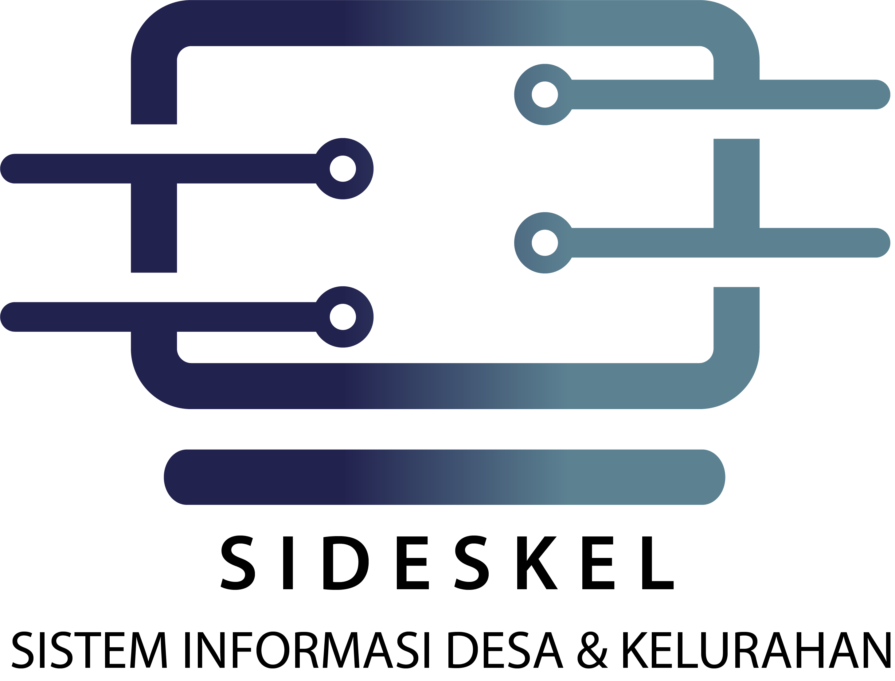
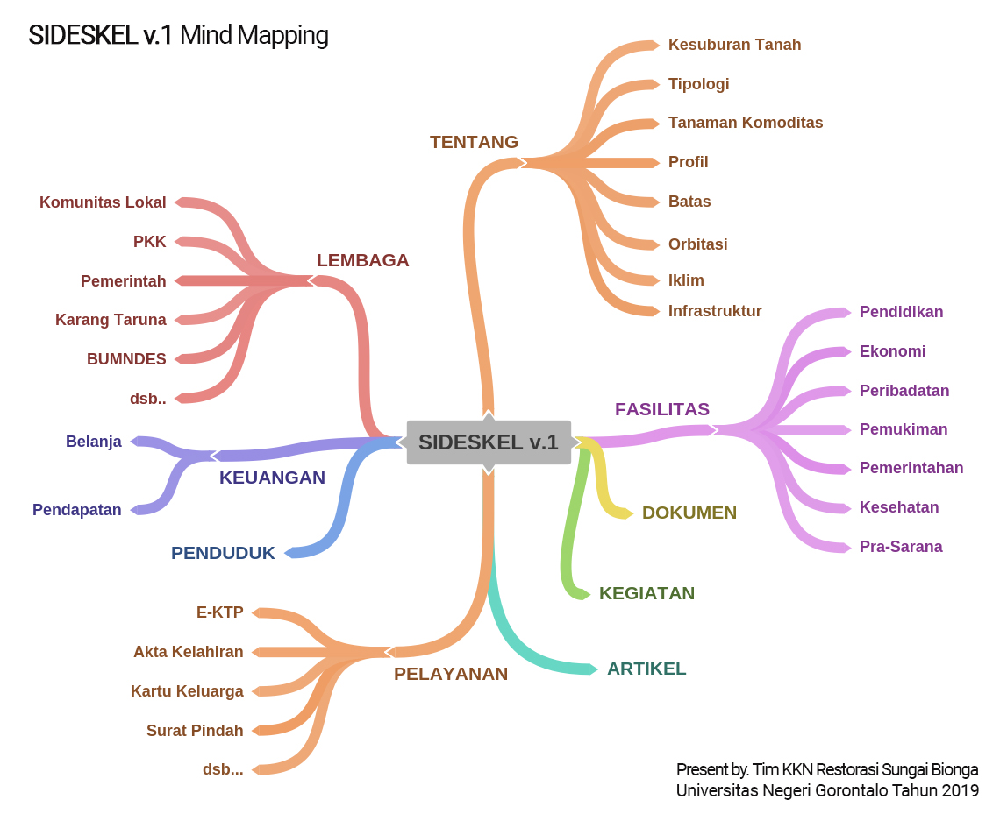
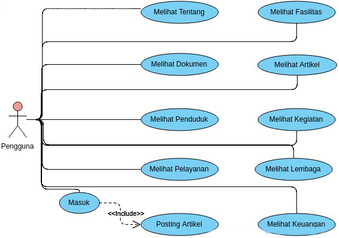
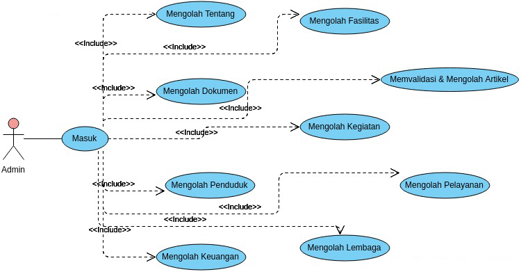

## Tentang

Disetiap kelurahan & desa tentunya punya potensinya masing-masing yang tentunya sangat bermanfaat jika dikembangkan namun kadang informasi mengenai potensi desa/kelurahan tersebut hanya sebatas warga desa/kelurahan saja, padahal jika informasi tersebut sampai ke pihak yang tepat maka ada kemungkinan potensi desa  bisa dikembangkan lebih lagi.
Selain itu juga mengenai keterbukaan informasi desa/kelurahan di Indonesia sangat minim padahal, keterbukaan informasi desa/kelurahan itu sangat penting untuk menghindari hal-hal yang di dinginkan seperti korupsi dana desa misalnya, kemudian selain itu kondisi demografis penduduk, fasilitas, infrastruktur, sampai dengan sejarah maupun kondisi desa/kelurahan juga bisa di publikasikan dengan jelas kepada masyarakat, sehingga membantu aparat desa untuk mengelola informasi yang menyangkut dengan pengelolaan desa/kelurahan, dengan alasan itulah maka Sistem Informasi Desa/Kelurahan (SIDESKEL) ini dikembangkan. SIDESKEL dikembangkan menggunakan framework Laravel 5.8.

## Tujuan 

- Menjadi platform resmi desa/kelurahan untuk menunjang penyebaran informasi kepada publik secara cepat & akurat. (Tentang, Lembaga, Fasilitas & Dokumen)
- Memfasilitasi aparat desa/kelurahan dalam hal transparansi keuangan (belanja & pendapatan) desa/kelurahan. (Keuangan)
- Membantu mempromosikan desa/kelurahan kepada publik lewat artikel yang dipublish oleh masyarakat. (Artikel)
- Memudahkan aparat desa/kelurahan dalam mengelola data penduduk. (Penduduk)
- Memudahkan masyarakat mengenai informasi pelayanan yang ada di kantor desa/kelurahan. (Pelayanan)
- Memfasilitasi desa/kelurahan dalam hal dokumentasi & publikasi kegiatan masyarakat. (Kegiatan)

## Mind Mapping

## Use Case Sistem
User: Pengguna

User: Admin

## Instalasi

Karena SIDESKEL dikembangkan dengan Laravel 5.8 silahkan jalankan dengan perintah php artisan migrate:fresh --seed pada terminal komputer anda.